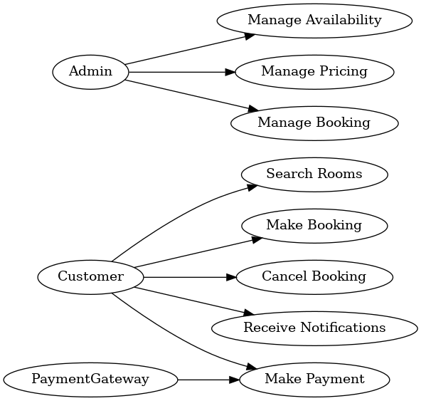

# Requirement Analysis in Software Development

## About the Project
The **Requirement Analysis Project** focuses on crafting a comprehensive foundation for software development by documenting, analyzing, and structuring requirements.  

Through a series of well-defined tasks, learners will create a **detailed blueprint of the requirement analysis phase** for a **Booking Management System**.  

This project simulates a real-world development scenario, emphasizing clarity, precision, and structure in defining requirements to set the stage for successful project execution.

---

## What is Requirement Analysis?

Requirement Analysis is a **critical phase in the Software Development Life Cycle (SDLC)** because it lays the foundation for the entire project. Skipping or poorly executing this step often leads to costly mistakes and project failures.  

##  Why is Requirement Analysis Important?
Here are three key reasons why it is important:

1. **Clarity and Shared Understanding**  
   Requirement analysis ensures that **developers, stakeholders, and end-users** all share the same vision of the system. It reduces miscommunication by clearly documenting what the system should do and what it should not do.  

2. **Early Detection of Issues**  
   Identifying gaps, conflicts, or ambiguities in requirements at an early stage prevents **costly rework** later in development. Fixing issues in requirements is far cheaper and faster than fixing them in design or coding stages.  

3. **Efficient Resource Utilization**  
   With well-defined requirements, teams can **plan resources, timelines, and budgets** more effectively. This minimizes wasted effort, ensures project deliverables are aligned with business goals, and increases the likelihood of project success.  

---

##  Key Activities in Requirement Analysis

Requirement Analysis involves a series of structured activities that ensure the system requirements are well understood, documented, and validated. The five key activities are:  

- **Requirement Gathering**  
  Collecting initial information about the project needs from stakeholders, users, and business documents. This step helps capture the high-level goals and expectations of the system.  

- **Requirement Elicitation**  
  Using techniques such as interviews, surveys, brainstorming sessions, and workshops to uncover detailed and hidden requirements from stakeholders. This ensures nothing critical is overlooked.  

- **Requirement Documentation**  
  Clearly recording the gathered requirements in a structured format (e.g., Software Requirement Specification - SRS). Documentation serves as a reference for all project stakeholders.  

- **Requirement Analysis and Modeling**  
  Analyzing requirements for feasibility, consistency, and completeness. Creating visual models such as use case diagrams, flowcharts, or ER diagrams to better understand system interactions and processes.  

- **Requirement Validation**  
  Reviewing requirements with stakeholders to confirm accuracy and alignment with business goals. This step ensures the requirements are realistic, testable, and approved before moving into design and development.  

---

##  Types of Requirements

In software projects, requirements are generally categorized into two groups: **Functional** and **Non-functional** requirements. Both play an important role in shaping the success of the system.  

###  Functional Requirements
Functional requirements describe **what the system should do** — the core features and functions the software must perform.  

**Examples for the Booking Management System:**  
- The system must allow users to **search for available rooms by date and location**.  
- The system must enable customers to **create, view, update, and cancel bookings**.  
- The system should allow users to **make online payments via credit card or mobile money**.  
- The system must send **email and SMS notifications** to customers after booking confirmation.  
- The system should allow administrators to **manage room availability and pricing**.  

### Non-functional Requirements
Non-functional requirements define **how the system should perform** rather than what it does. These focus on system quality, constraints, and performance expectations.  

**Examples for the Booking Management System:**  
- The system must be able to handle **at least 500 concurrent users** without performance degradation.  
- All booking confirmations should be processed in **less than 3 seconds**.  
- The system should have **99.9% uptime availability**.  
- The platform must comply with **data protection and privacy regulations (e.g., GDPR)**.  
- The system should support **multiple languages (English, French, Twi)** for broader accessibility.  

---

##  Use Case Diagrams  

Use Case Diagrams are a **visual representation** of the interactions between users (**actors**) and the system. They help to:  

- Identify the **main system functionalities** from a user’s perspective.  
- Clarify the **roles and responsibilities** of each actor.  
- Serve as a communication tool between stakeholders and developers.  
- Provide a **high-level view** of how the system will be used.  

###  Example: Booking Management System  

Below is a sample **Use Case Diagram** for the Booking Management System.  

Actors involved:  
- **Customer** – Searches, books, pays, cancels reservations, receives notifications.  
- **Admin** – Manages room availability, pricing, and bookings.  
- **Payment Gateway** – Handles secure payment transactions.  

 

---

## Acceptance Criteria

Acceptance Criteria are predefined conditions that a system or feature must meet to be accepted by stakeholders. They ensure that requirements are measurable, testable, and aligned with business goals.

### Importance of Acceptance Criteria:

- Ensure clear understanding between developers, testers, and stakeholders.

- Provide a basis for testing and validation.

- Prevent scope creep by defining when a feature is “done.”

- Example – Checkout Feature in Booking Management System:

- The user must be able to add selected bookings to a checkout cart.

- The system must display the total price, including taxes and fees.

- Payment options (credit card, PayPal, and mobile money) must be available.

- A confirmation email must be sent to the user after successful payment.

- If payment fails, the system must notify the user with an error message and allow retry.

---

